# Movie Database Management System

This project includes functions for:

- Searching for a movie based on genre and selected tags
- Sorting movies by user ratings from different platforms
- Adding new movies to the database
- Deleting existing movies from the database
- Graphical user interface for user interaction.

## Data Source

The project uses a ready-made database from Kaggle (https://www.kaggle.com/datasets/garymk/movielens-25m-dataset). The database consists of three files:

- movies.csv: contains movie titles and genres
- ratings.csv: includes ratings for movies from different platforms
- tags.csv: tags that can be used to find movies


## User Interface

The graphical user interface is implemented using the **EasyGUI** library. With the `def searching_and_sorting` function user can choose what can be done with the existing film library:

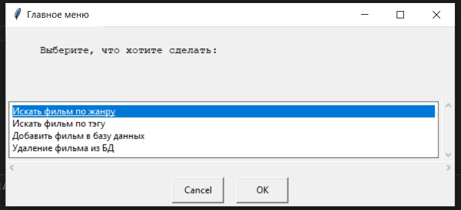

If the user chooses "Search for a movie by genre", then using the `def genre_entry` function we prompt the user to enter the movie genre in a pop-up window:

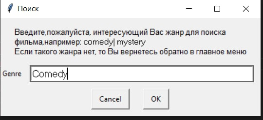

Similarly when the user chooses “Search movie by tag”:

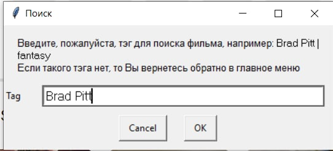

And also user can choose functions for updating the database, i.e. either add a new movie to the database, or delete any existing movie. Details about these functions are described in the data manipulation module.

## Movie Search and Sorting Module

After selecting a genre or tag, the system searches for matching movies and sorts them by ratings using functions `similarity_tags` and `similarity_genre`. The fuzzywuzzy library is used to find matching values in the dataset. If a suitable match is found, the user is presented with a list of movies ranked by ratings:

```python
def similarity_tags(user_input):#функция, которая сравнивает ввод пользователя с данными в файлах на предмет совпадения более 90%
    tag_list = tags['tag'].unique()
    query = user_input
    choises = tag_list
    res = process.extract(query,choises)
    print(res)
    global similarity
    similarity = [i for i in res if i[1] > 90]
    print(similarity)
    if similarity == []:#если совпадений не найдено, то возвращаемся обратно в окно ввода
        us.tags_entry()
    else:
        tag()
```

If a suitable value is found, then we head to the `def tag` or `def genre` function, where we again iterate through the dataframe from the data file and form a new dataframe from the list with selected movie titles, having previously sorted this list by rating. As a result, the user can observe the following window:

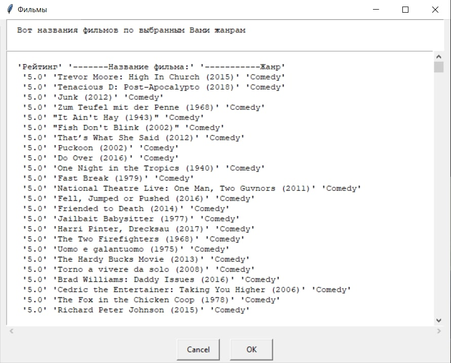

If nothing suitable is found, the user will return back to the input window for the genre or tag of interest.

## Data Manipulation Module

Users can add new movies or delete existing ones from the database using functions `add_info` and `delete_info`. When adding a new movie, users are prompted to enter the movie title and genre.

If user needs to add a new movie, he is prompted to enter its title and genre:

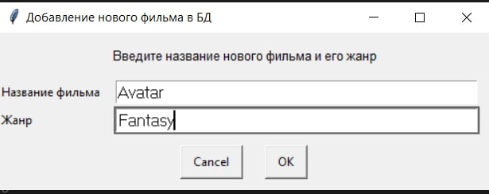

And we notify the user that the movie was successfully uploaded to the database:

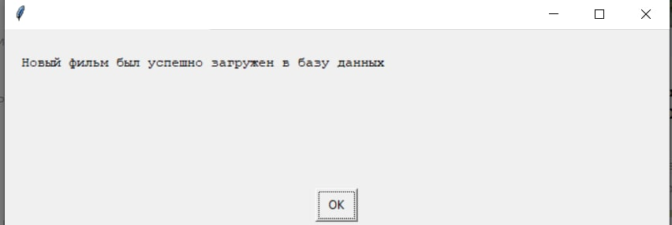

And indeed we see that the film has been added:

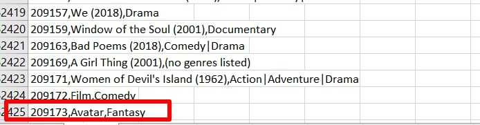

If the user needs to delete a movie, we also prompt him to enter the name of the movie and its release year:

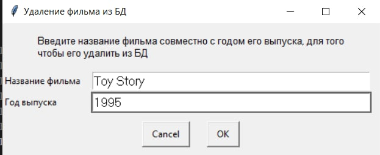

We also notify the user that the movie was successfully deleted:

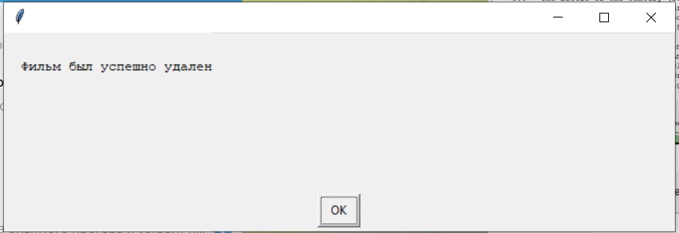

And indeed we see that the film has been deleted from the database:

**Before:**

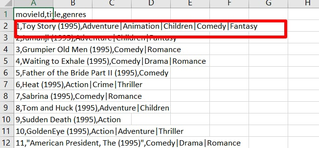

**After:**

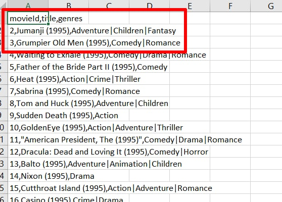

## Contributors

Feel free to contribute to this project by forking and submitting a pull request. Thank you for your interest and support! 


