# Информационная система по поиску, сортировке и работы с базой данных по фильмам

В данном проекта были реализованы функции:

- поиска интересующего пользователя фильма по жанру и по выделенным тэгам;

- сортировка фильмов по их оценкам пользователей с разных платформ;

- добавление новых фильмов в базу данных;

- удаление уже имеющихся фильмов из базы данных;

- также предусмотрен графический интерфейс для взаимодействия с пользователем. 

Для реализации проекта была взята готовая база данных с сайта: https://www.kaggle.com/datasets/garymk/movielens-25m-dataset

В данной базе данных представлены три файла:

- movies.csv- файл с названием фильмов и их жанрами

- ratings.csv - файл с рейтингами по фильмам,собранными с разных площадок

- tags.csv - файл с тэгами, по которым можно найти фильм.


## Интерфейс программы

Графический интерфейс для работы с пользователем реализован с помощью библиотеки **EasyGUI**. С помощью функции `def searching_and_sorting` мы обращаемся к пользователю и даем ему возможность выбрать, что можно сделать с имеющейся фильмотекой:

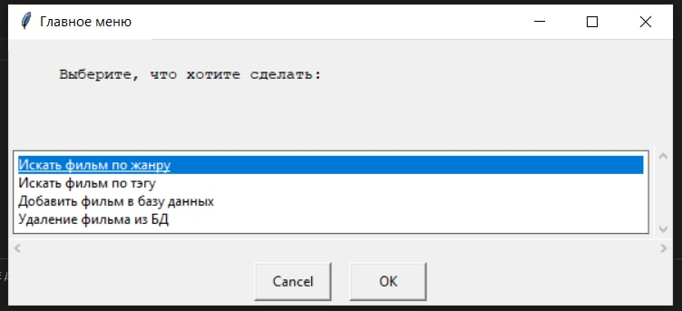

Если пользователь выбирает "Искать фильм по жанру", то с помощью функции `def genre_entry` мы предлагаем пользователю ввести интересующей его жанр фильма в всплывающее окно:

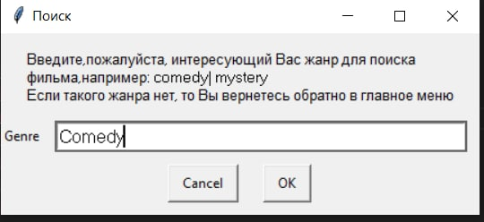

Аналогично с выбором пользователем "Искать фильм по тэгу":

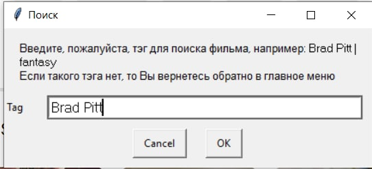

И также пользователю предлагается выбрать функции по корректировке базы данных, т.е. либо добавить новый фильм в базу данных, либо удалить любой уже имеющийся фильм. Об этих функциях будет подробно описано в модуль по добавлению и удалению данных.

# Модуль поиска и сортировки фильмов

После того как пользователь введет интересующей его жанр фильма или тэг, тесно связанный с определенным фильмом, то нам необходимо найти и подобрать список фильмов по заданным параметрам, также предварительно отсортировав их по рейтингу.

Этот функционал реализован в модуле поиска и сортировки данных с помощью функций `def similarity_tags` и `def similarity_genre`. Используя библиотеку `fuzzywuzzy`, мы ищем в файле совпадающее значение с запросом пользователя:

```python
def similarity_tags(user_input):#функция, которая сравнивает ввод пользователя с данными в файлах на предмет совпадения более 90%
    tag_list = tags['tag'].unique()
    query = user_input
    choises = tag_list
    res = process.extract(query,choises)
    print(res)
    global similarity
    similarity = [i for i in res if i[1] > 90]
    print(similarity)
    if similarity == []:#если совпадений не найдено, то возвращаемся обратно в окно ввода
        us.tags_entry()
    else:
        tag()
```

Если найдено подходящее значение, то далее мы направляемся в функцию `def tag` или `def genre`, где мы вновь перебираем датафрейм из файла с данными и формируем уже новый датафрейм из списка с отобранными названиями фильмов, предварительно отсортировав этот список по рейтингу. В итоге пользователю показывается такое окошко:

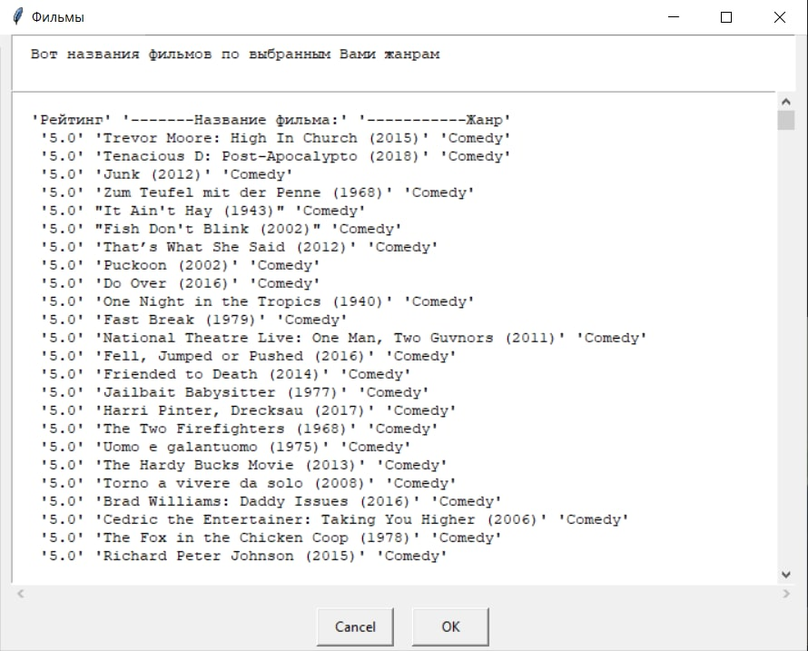

Если же ничего подходящего не найдено, то пользователь вернется обратно на окно ввода интересующего его жанра или тэга.

# Модуль добавления и удаления информации из базы данных

Также в главном меню пользователю предлагают добавить новый фильм в базу данных или же удалить уже существующий фильм из фильмотеки. Этот функционал реализован с помощью функций `def add_info` и `def delete_info`.

Если пользователю необходимо добавить  новый фильм, то ему предлагается ввести его название и жанр:

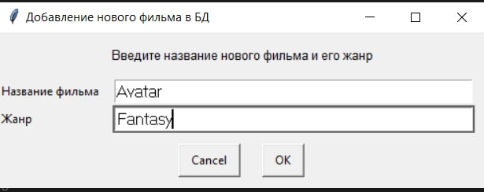

И уведомляем пользователя, что фильм был успешно загружен в базу данных:

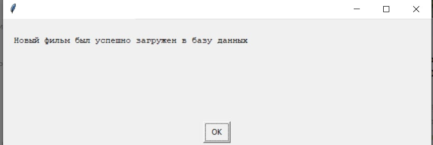

И действительно видим, что фильм был добавлен: 

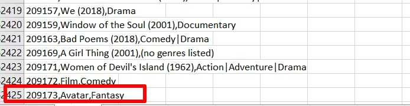

Если пользователю нужно удалить фильм, то мы также предлагаем ему ввести название фильма и его год выпуска:

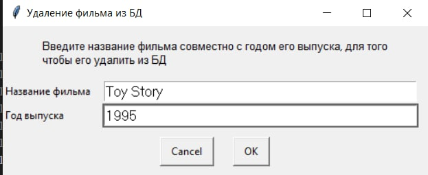

Также уведомляем пользователя, что фильм был успешно удален:

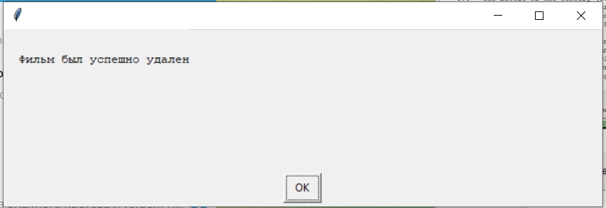

И действительно видим, что фильм был удален из базы данных:

**До:**

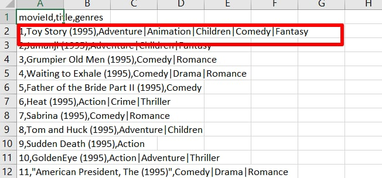

**После:**

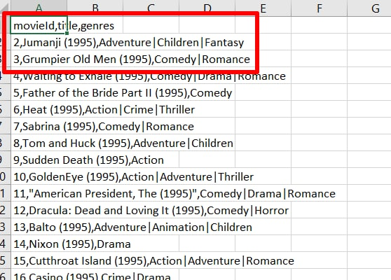


